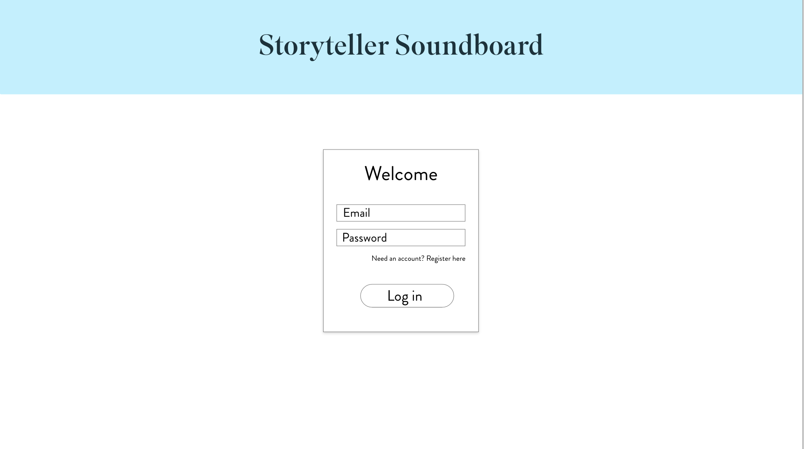
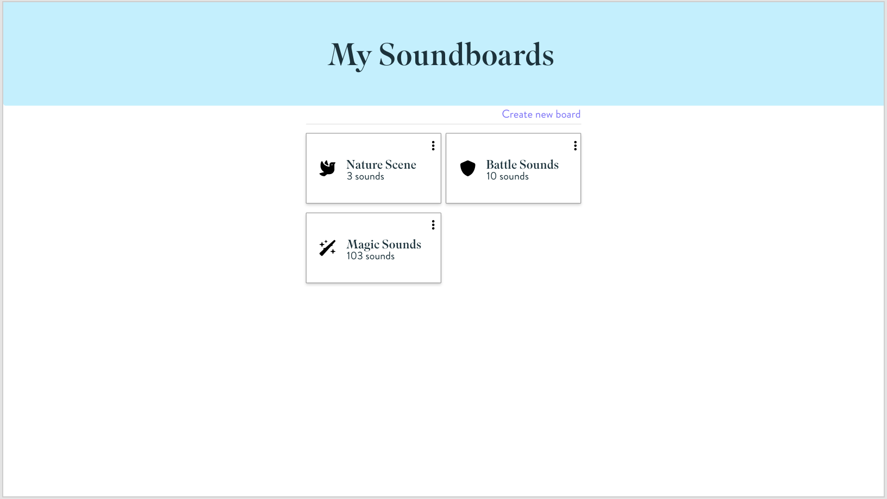
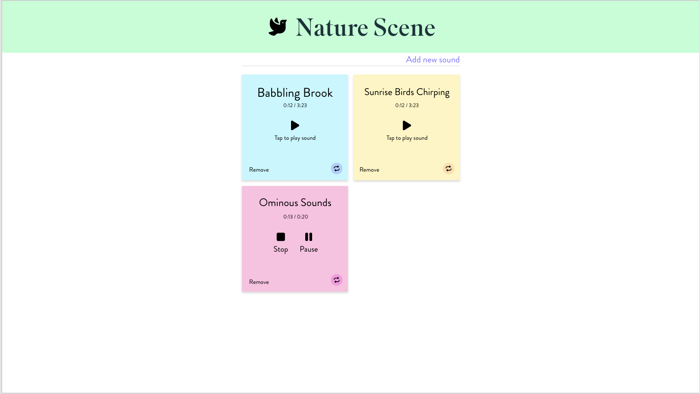
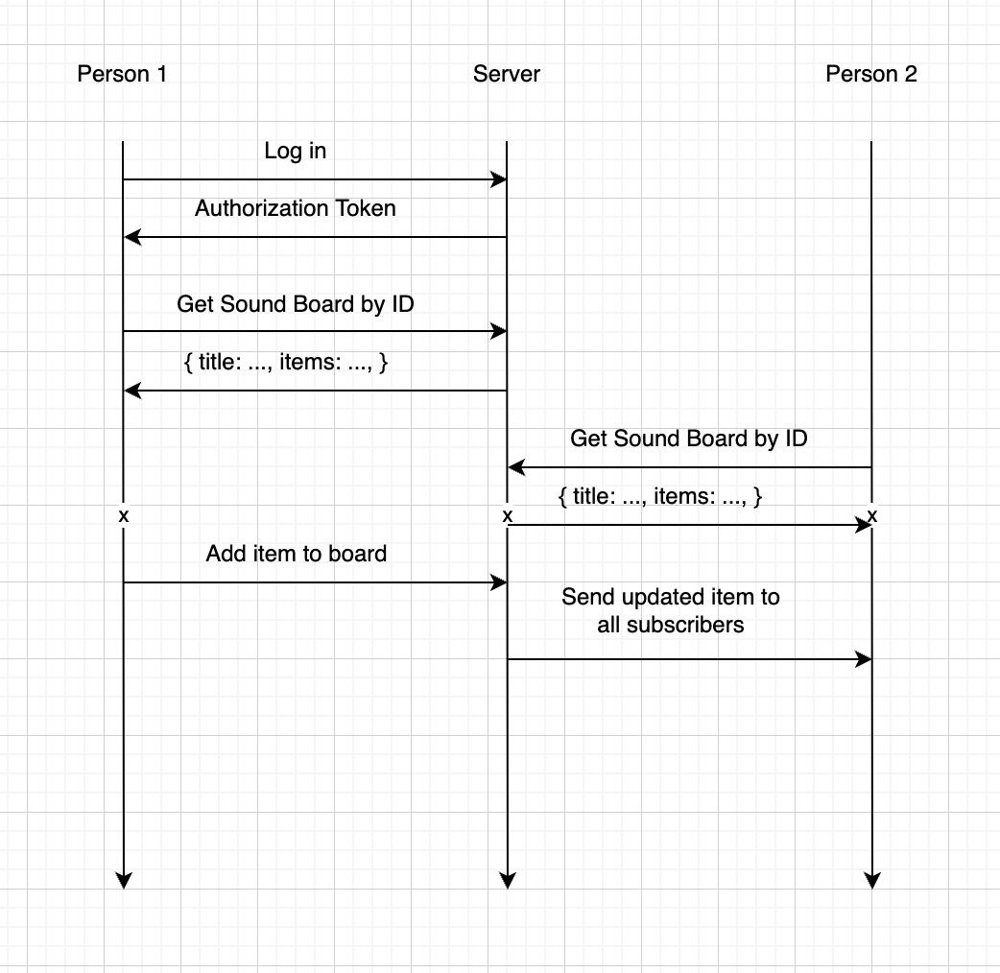
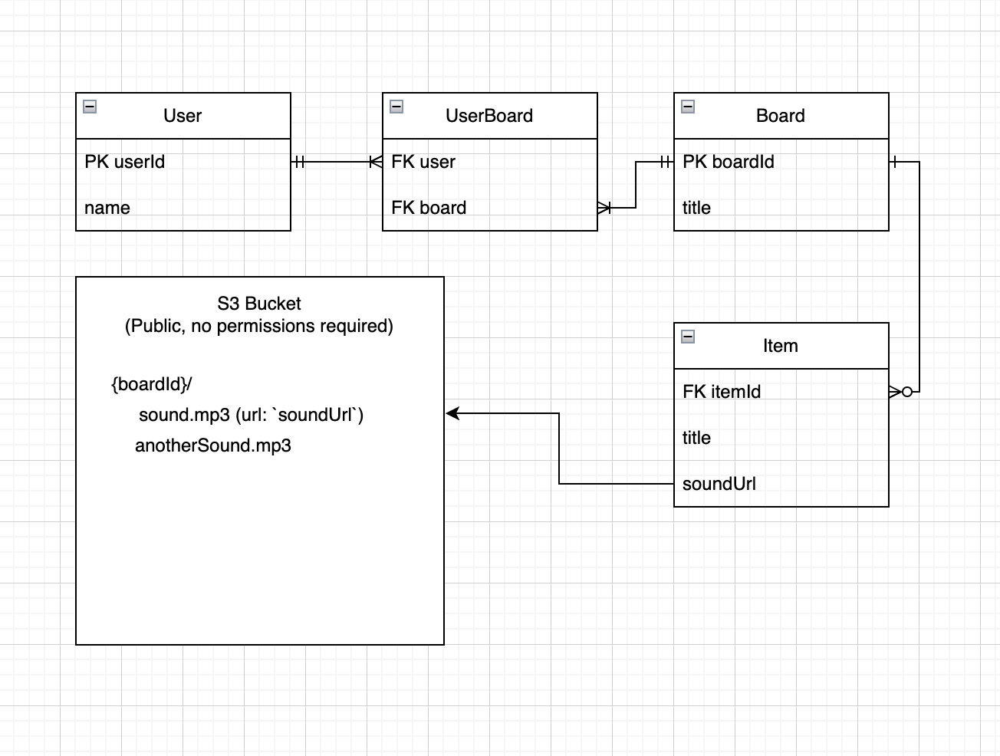

# Storyteller Soundboard
Dungeons and Dragons is rapidly becoming the most popular tabletop role-playing game in America. With incredibly high production DnD podcasts and tv shows becoming more and more common, peoples' standards are becoming higher. Sound effects and awesome music elevate the experience ten-fold. You and all your friends need a way to have a shared soundboard you can pull up on your phone to use during all of your DnD sessions.

## Design
The user will begin by logging in

Next, they will be taken to a dashbord which lists all of the soundboards they own

Each soundboard is composed of a list of sound files that can be played by tapping them

### User Interaction
Here is an example of how the users will interact with the application. When a change is made to a soundboard, it will be instantly reflected on all other clients that are also observing that soundboard. This will be accomplished using websockets

### This is a quick sketch of the database for this application:
- A user can have many boards
- A board can have many users
- A board can have many items
- Sound files will be stored in a public S3 bucket (without privacy rules for simplicity's sake) and will be referenced by url in the item entries of the database

## Key Features
- Ability to securely log in over HTTPS
- Users can create soundboards and invite their friends
- All changes will be reflected on each client in real time
- Sounds can be uploaded and will be stored in the cloud
- Sounds can be played and paused by tapping on the squares

## Technologies
The required technologies will be used in the following ways.
- **HTML** - Uses HTML to structure application. There will be 3 pages: log in, dashboard, soundboard page. Hyperlinks will be used for navigation.
- **CSS** - Application will have responsive design for small and large screens. Colors and fonts will look nice, although the application will have a very basic look.
- **Javascript** - Functionality for: log in, displaying / filtering soundboards and sounds, controlling sound playback, uploading sounds to cloud, CRUD operations for soundboards and sounds.
- **Service** - Backend service with endpoints for:
  - Create, Read, Update, Delete soundboards
  - Create, Read, Update, Delete soundboard items
  - Upload sound file
- **DB** - Store users, soundboards, sounds (items)
- **BONUS: S3 Bucket** - Store sound files in cloud
- **Login** - Register and login users. Credentials securely stored in database. Can't view / edit soundboard unless logged in and are added to the soundboard.
- **WebSocket** - As a soundboard is edited, all changes will be broadcast to other users of that soundboard.
- **React** - Application will eventually use the React framework

## HTML Deliverable
For this deliverable I built out the structure of the application in HTML
- **HTML Pages** - Login, About, Soundboards (dashboard), and an example Soundboard page
- **Links** - The login page automatically links to the Soundboards page. There is a navbar with links to all the pages
- **Text** - The Soundboards and sounds within them are represented by a text-based depictions
however they will be more colorful and structured when we do the css deliverable.
- **Images** - There is an inspiring image on the about page for users to be inspired by
- **Login** - Input box and submit button for username and password
- **Database** - The soundboards will be stored in the database for each user
- **External service** - The sounds themselves will be hosted on AWS S3
- **WebSocket** - The sounds on each soundboard will update automatically on each client when
changes are made by using WebSocket connections

## CSS Deliverable
For this deliverable I added CSS to structure and style the components of my application (although it is still not functional)

NOTE: I have decided to use tailwindcss as my css framework, and until we start using `npm` I have to serve the entire tailwindcss
library which makes my website load pretty slow. When we add `npm` I will be able to use the tailwind pre-compiler to drastically cut
down the code shipped by tailwind to the client and it will load much faster!

- **Header, Footer, Main content** - The Header prominently display app name in a nice font, body elements are centered on the page, and footer is visible, yet stylishly simple and uncluttered
- **Navigation Elements** - Navigation is present in the header bar. The text wraps on smaller screens, which looks a little funny, but when we add javascript I will add a hamburger icon and a sidebar menu on smaller screens
- **Responsive to window resizing** - The gallery components (i.e. Sounboards on the dashboard view, and sounds on the soundboard view) are in a responsive grid pattern. On larger screens there are 2 or 3 columns and on smaller screens there are 1 or 2 columns. Also sound boxes use the aspect ratio property to maintain square dimensions (wherever possible).
- **Application elements** - The soundboards and sounds are places on nicely styled cards to provide a clear user interface. It's obvious that they are interacted with through clicking / tapping. All necessary application components are present.
- **Application text content** - Text is present to indicate what to do to the user. There is also a nice about page that explains the purpose of the application.
- **Application images** - The application does not use very many images, however FontAwesome is used for icons.
- **Colors** - colors have been added to provide more variety
- **Fonts** - 2 solid clean fonts have been chosen, one for headers and display text, the other for body

## Javascript Deliverable

- **Javascript Support for future login:** The user is able to log in, and their info will automatically be persisted in localStorage in the mock database. Multiple users can log in and the current user will be set in localStorage.

- **Javascript for future database data:** All data is stored in a localStorage key called `db`. I have also created functions that access that `db` that will be adapted to work with the future db.

- **Javascript support for future WebSocket:** I have created a function that takes incoming sound data and adds it to a given board. This will be called when the WebSocket sends add events.

- **Javascript support for application interaction logic:** I have created functions to perform CRUD operations on the mock database. Each user has an array of boards and each board has an array of sounds. The UI is re-rendered to display this dynamic content.

- **Sounds:** The user can click on sounds to play them back. They can also cancel them.

- **Future support for external service (S3 Bucket for Uploading Sound Files):** Currently, it is not possible to add sound files because we have not implemented the file upload service. However, fake sounds can be added to sound boards.

- **Customizable icons and colors:** Sounds and soundboards are fully customizable with icons and colors